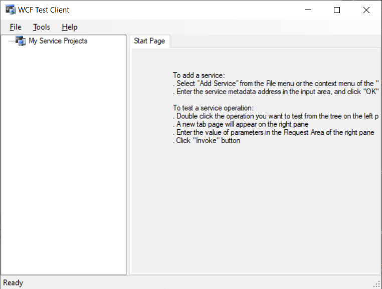

# Recommended tools

Feel free to search it by name for more fresh links.

## git

Version control system [git](https://git-scm.com).  
  
How to learn:  
[https://git-scm.com/docs](https://git-scm.com/docs).  

# GitExtensions

Easy GUI for git:  
[https://github.com/gitextensions/gitextensions](https://github.com/gitextensions/gitextensions)

# Visual Studio

[https://visualstudio.microsoft.com/](https://visualstudio.microsoft.com/)  

# Visual Studio Code

[https://code.visualstudio.com/](https://code.visualstudio.com/)  

# Keepass

Password keeping tool:

[https://keepass.info/](https://keepass.info/)  

# WCF Test Client

To test WCF services:  

After installing Visual Studio you can find it here:  

[https://learn.microsoft.com/en-us/dotnet/framework/wcf/wcf-test-client-wcftestclient-exe](https://learn.microsoft.com/en-us/dotnet/framework/wcf/wcf-test-client-wcftestclient-exe)

(Currently I want to use OpenAPI with swagger files so WCF will probably depricate.)

# Postman

[https://www.postman.com/](https://www.postman.com/)

# Microsoft SQL Server Management Studio

SSMS:  

[https://learn.microsoft.com/en-us/sql/ssms/download-sql-server-management-studio-ssms?view=sql-server-ver16](https://learn.microsoft.com/en-us/sql/ssms/download-sql-server-management-studio-ssms?view=sql-server-ver16)

# Node.js

[https://nodejs.org/](https://nodejs.org/)

# dotnet

[https://dotnet.microsoft.com](https://dotnet.microsoft.com)
