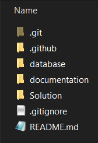

# Repository structure

Regular web project repository is suppose to use (only) one database. Using following reposotory structure:

- .git
    - git
- .github
    - GitHub specific files (CODEOWNERS, actions, ...)
- database
    - scripts to recreate or update DB
- documentation
    - all recieved requirements
    - structured in named folders: YYYYMMDD - short description
- Solution
    - C# and TS files
    - idealy one solution and multiple projects

## Do not place to repository

Big files (like DB backups). Binary files, artefacts, libraries. 